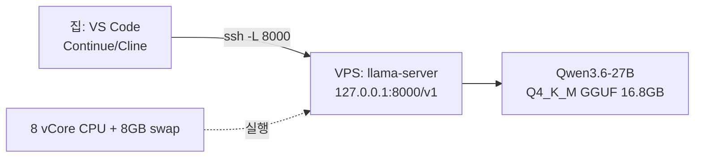

# Qwen3.6-27B CPU 추론 서버 — VS Code 에이전트용

VPS(8 vCore / 22GB RAM / 200GB SSD, CPU 전용)에서 Qwen3.6-27B를 서빙하고,
집에서는 SSH 포워딩으로 VS Code 에이전트를 연결해 쓰는 구성입니다.

## 구성도



## 조작은 3개 스크립트뿐

| 스크립트 | 역할 | 시점 |
|---|---|---|
| `./init.sh` | 의존성 설치 · 스왑 8GB · llama.cpp 빌드 · 모델 다운로드(~17GB) | 최초 1회 |
| `./up.sh` | 서버 시작 + 헬스체크 + 접속 정보 출력 | 평상시 |
| `./down.sh` | 서버 종료 | 평상시 |

```bash
./init.sh   # 1회 (빌드 5~10분 + 다운로드 시간. 중단 후 재실행하면 이어받기)
./up.sh     # 시작 (첫 로딩 1~3분)
./down.sh   # 종료
```

- 로그: `logs/llama-server.log`, PID: `llama-server.pid`
- 튜닝은 `config.env` 하나만 수정하면 됩니다 (재시작 시 반영).

## 품질 우선 기본값

- Qwen3.6 공식 권장 thinking 샘플링: `temp 0.6 / top_p 0.95 / top_k 20`
- thinking 모드 ON(기본), KV캐시 `q8_0`(f16 대비 품질 차이 미미, 메모리 절반)
- 컨텍스트 32K — 긴 프롬프트 OK. `config.env`의 `CTX_SIZE`로 64K까지 확장 가능
  (단, KV캐시가 늘어나므로 `free -h`로 여유 확인 후)
- 속도보다 정확도: 응답 1회에 수 분 걸릴 수 있음이 정상입니다

## 집에서 접속 (SSH 포워딩)

터널 생성 (창을 하나 띄워 두기):

```bash
ssh -N -L 8000:127.0.0.1:8000 ubuntu@<VPS_IP>
```

- 이후 집 PC에서 `http://localhost:8000/v1` 이 서버로 연결됩니다.
- VS Code **Remote-SSH**로 VPS에 접속한 상태라면 포워딩 없이 `http://127.0.0.1:8000/v1` 그대로 사용하면 됩니다.
- Windows라면 PowerShell에 위 명령을 그대로 쓰거나, Putty의 Connection → SSH → Tunnels에서 동일 설정.

## VS Code 에이전트 연결

### A. Continue (추천)

`~/.continue/config.json`:

```json
{
  "models": [
    {
      "title": "Qwen3.6-27B (VPS)",
      "provider": "openai",
      "model": "Qwen3.6-27B",
      "apiBase": "http://localhost:8000/v1",
      "apiKey": "local"
    }
  ],
  "contextLength": 24576,
  "completionOptions": { "maxTokens": 4096 }
}
```

### B. Cline / Roo Code

- API Provider: **OpenAI Compatible**
- Base URL: `http://localhost:8000/v1`
- API Key: 아무 값(예: `local`)
- Model ID: `Qwen3.6-27B`
- 참고: Cline은 시스템 프롬프트가 커서 CPU 환경에서는 턴당 수 분 걸립니다. Continue가 더 가볍습니다.

## 예상 성능 (정직한 기준)

| 항목 | 예상 |
|---|---|
| 생성 속도 | 2~4 tok/s (Q4_K_M, AVX2 8코어) |
| 프롬프트 처리 | 512 배치 기준 ~50~150 tok/s |
| 응답 1회 | thinking 포함 1~3K 토큰 → **수 분** |
| 메모리 | 모델 16.8GB + KV 1GB + 런타임 ≈ 19~20GB / 22GB |

자동완성(FIM) 용도로는 부적합하고, **챗/작업 위임형 에이전트**에 맞습니다.

## 트러블슈팅

| 증상 | 원인/해결 |
|---|---|
| `up.sh` 직후 프로세스 종료 | `logs/llama-server.log` 확인. 대부분 OOM → `CTX_SIZE` 16384로 낮추고 `./down.sh && ./up.sh` |
| 응답이 매우 느림 | 스왑 사용 중일 가능성 → `free -h` 확인. 불필요한 프로세스 정리 |
| 다운로드 중단 | `./init.sh` 재실행 → 이어받기 |
| 집에서 연결 안 됨 | 터널이 살아있는지, `HOST=127.0.0.1` 유지인지 확인 |
| 서버 재부팅 후 | `./up.sh` 한 번만 다시 실행 |

## 보안

- `HOST=127.0.0.1` 기본값: 외부에서 직접 접근 불가, SSH 터널로만 진입.
- 0.0.0.0 바인딩은 비추천 (API에 인증이 없음).
