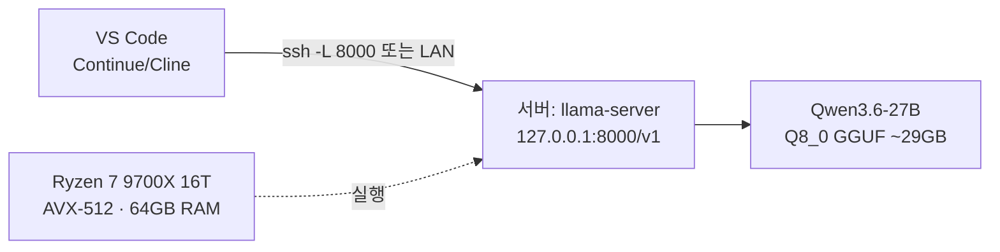

# Qwen3.6-27B 로컬 LLM 서버 — VS Code 에이전트용

자택/사무실 서버(**Ryzen 7 9700X · 64GB DDR5-5200 On-Die ECC · NVMe 소프트 RAID**)에서
Qwen3.6-27B를 서빙하고, SSH 포워딩 또는 LAN으로 VS Code 에이전트를 연결해 쓰는 구성입니다.

> 💻 VS Code에서 에이전트로 쓰는 방법(Cline/Roo/Continue 설정)은
> [VSCODE_AGENT.md](VSCODE_AGENT.md) 참고
> 📐 각 설정의 근거(왜 이 값인가)는 [SETTINGS_RATIONALE.md](SETTINGS_RATIONALE.md) 참고

## 구성도



## 조작은 3개 스크립트뿐

| 스크립트 | 역할 | 시점 |
|---|---|---|
| `./init.sh` | 의존성 설치 · llama.cpp 빌드(AVX-512) · 모델 다운로드(~29GB) | 최초 1회 |
| `./up.sh` | 서버 시작 + 헬스체크 + 접속 정보 출력 | 평상시 |
| `./down.sh` | 서버 종료 | 평상시 |

```bash
./init.sh   # 1회 (빌드 3~6분 + 다운로드 시간. 중단 후 재실행하면 이어받기)
./up.sh     # 시작 (첫 로딩 1~2분)
./down.sh   # 종료
```

- 로그: `logs/llama-server.log`, PID: `llama-server.pid`
- 튜닝은 `config.env` 하나만 수정하면 됩니다 (재시작 시 반영).
- RAM이 32GB 이상이면 `init.sh`가 스왑 생성을 자동으로 건너뜁니다.

## 품질 우선 기본값

- Qwen3.6 공식 권장 thinking 샘플링: `temp 0.6 / top_p 0.95 / top_k 20`
- thinking 모드 ON(기본), KV캐시 `q8_0`(f16 대비 품질 차이 미미, 메모리 절반)
- 퀀트 기본 `Q8_0`(8비트, 원본 품질에 근접) — 64GB RAM 덕에 가능. VPS 시절 Q4_K_M보다 두 단계 위
- thinking 강도 `high` — 추론을 더 오래 하도록 유도, 난이도 있는 작업의 논리 품질↑
- MTP 추측 디코딩(`draft-mtp`) 기본 ON — 같은 모델로 품질 손실 없이 생성 속도↑ (아래 섹션 참고)
- 컨텍스트 기본 64K (64GB RAM 기준 안전). `config.env`의 `CTX_SIZE`로 조절 가능
- 속도보다 정확도: 응답 1회에 십수 분~수십 분 걸릴 수 있음이 정상입니다

## 하드웨어 활용 메모 (9700X · 64GB · NVMe RAID)

- **AVX-512**: Zen 5는 512비트 AVX-512를 지원합니다. 네이티브 빌드(`-DGGML_NATIVE=ON`)가
  자동 활성화하며, 프롬프트 처리 속도가 구형 CPU 대비 2배 이상 빨라집니다.
- **메모리 대역폭**: 토큰 생성 속도는 사실상 RAM 대역폭에 좌우됩니다.
  상한은 대략 `대역폭(GB/s) ÷ 모델크기(GB)` tok/s (DDR5-5200 듀얼채널 ≈ 60GB/s).
- **On-Die ECC**: DDR5 자체 오류정정으로 램 셀 오류를 줄여줍니다.
  (CPU-메모리 구간 전체를 보장하는 서버용 풀 ECC는 아니므로 참고 수준)
- **NVMe 소프트 RAID**: 모델 로딩이 빨라질 뿐, 추론 중에는 성능 영향이 없습니다.
- **전력/발열**: CPU 추론은 지속 풀로드입니다. 서버실 통풍·쿨러 상태를 확인하세요.
- **더 빠른 긴 컨텍스트**: 플래시 어텐션은 최신 버전 기본 `auto`. 효과를 명시하려면 `LLAMA_EXTRA_ARGS="--flash-attn on"` (오류 나면 제거)

## 퀀트 선택 (`config.env`의 `MODEL_FILE`)

| 파일 | 크기 | 품질 | 생성 속도 | 비고 |
|---|---|---|---|---|
| `Qwen3.6-27B-Q8_0.gguf` | ~29GB | 최고 | ~2 tok/s | **기본값** |
| `Qwen3.6-27B-Q6_K.gguf` | ~22GB | 준최고 | 2~3 tok/s | 속도 절충안 |
| `Qwen3.6-27B-Q5_K_M.gguf` | ~21GB | 중상 | 2~3 tok/s | Q4보다 품질↑ |
| `Qwen3.6-27B-Q4_K_M.gguf` | ~17GB | 양호 | 3~4 tok/s | VPS 시절 기본값 |

## MTP 추측 디코딩 (`draft-mtp`)

생성 속도를 품질 손실 없이 올리는 기능입니다. 원리: 모델 내부의 MTP(Multi-Token
Prediction) 헤드가 다음 토큰을 3개 미리 예측하고, 메인 모델이 한 번의 가중치 통과로
3개를 동시에 검증합니다. 검증은 메인 모델이 하므로 **출력 품질은 동일**하고,
CPU처럼 메모리 대역폭에 묶인 환경에서 특히 효과가 큽니다.

- **별도 모델 파일 불필요**: MTP 헤드는 메인 GGUF 파일 안에 포함되어 있습니다.
  `-mtp.gguf` 같은 별도 파일을 받으면 안 됩니다. `init.sh`가 다운로드 후
  MTP 헤드 포함 여부를 자동으로 알려줍니다.
- 적용 옵션: `config.env`의 `SPEC_TYPE="draft-mtp"` + `SPEC_DRAFT_N_MAX="3"` (기본값).
- 기대 효과: 수락률 60~80% 시 **1.5~2배** 생성 속도 향상. 코드·반복 패턴에서 수락률이
  높고, 자유 창작 글에서는 낮아집니다.
- 메모리 비용: 드래프트 KV 캐시 약 8GB 추가 (총 ~46~50GB, 64GB 내 여유 있음).
- GGUF에 MTP 헤드가 없는 구형/타 모델이면 시작 시 실패 → `SPEC_TYPE=""` 로 끄면 됩니다.

## 원격 접속

### A. SSH 포워딩 (기본, 권장)

터널 생성 (창을 하나 띄워 두기):

```bash
ssh -N -L 8000:127.0.0.1:8000 <사용자>@<서버_IP>
```

- 이후 클라이언트 PC에서 `http://localhost:8000/v1` 이 서버로 연결됩니다.
- 서버가 VS Code **Remote-SSH** 대상이면 포워딩 없이 `http://127.0.0.1:8000/v1` 그대로 사용합니다.
- Windows라면 PowerShell에 위 명령을 그대로 쓰거나, Putty의 Connection → SSH → Tunnels에서 동일 설정.

### B. LAN 직접 연결 (같은 네트워크일 때)

`config.env`에서:

```bash
HOST="0.0.0.0"
API_KEY="적당히-긴-랜덤-문자열"   # 비워두지 말 것!
```

- `./down.sh && ./up.sh` 후 `http://<서버_IP>:8000/v1` 로 접속.
- API Key는 에이전트 설정의 API Key 항목에 동일하게 입력합니다.
- 공유기에 포트포워딩으로 **외부에 직접 여는 것은 비권장** — SSH 포워딩이 안전합니다.

## VS Code 에이전트 연결

### A. Continue (추천)

`~/.continue/config.json`:

```json
{
  "models": [
    {
      "title": "Qwen3.6-27B (Server)",
      "provider": "openai",
      "model": "Qwen3.6-27B",
      "apiBase": "http://localhost:8000/v1",
      "apiKey": "local"
    }
  ],
  "contextLength": 32768,
  "completionOptions": { "maxTokens": 4096 }
}
```

### B. Cline / Roo Code

- API Provider: **OpenAI Compatible**
- Base URL: `http://localhost:8000/v1`
- API Key: 아무 값(예: `local`)
- Model ID: `Qwen3.6-27B`
- 참고: Cline은 시스템 프롬프트가 커서 CPU 환경에서는 턴당 수 분 걸립니다. Continue가 더 가볍습니다.

## 예상 성능 (정직한 기준)

| 항목 | 예상 |
|---|---|
| 생성 속도 | Q8_0 ~2 tok/s · Q6_K 2~3 tok/s · Q4_K_M 3~4 tok/s (MTP 수락 시 1.5~2배) |
| 프롬프트 처리 | 200~500 tok/s (AVX-512, 배치 2048) |
| 응답 1회 | thinking(high) 포함 3~8K 토큰 → **십수 분~수십 분** |
| 메모리 | Q8_0 29GB + KV 8GB + MTP 드래프트 KV 8GB + 런타임 ≈ 46~50GB / 64GB |

자동완성(FIM) 용도로는 부적합하고, **챗/작업 위임형 에이전트**에 맞습니다.

## 트러블슈팅

| 증상 | 원인/해결 |
|---|---|
| `up.sh` 직후 프로세스 종료 | `logs/llama-server.log` 확인. 메모리 부족 시 `CTX_SIZE`를 32768로 낮추고 `./down.sh && ./up.sh` |
| 옛 VPS 설정 그대로임 | `config.env`는 이미 있으면 덮어쓰지 않습니다. 새 기본값을 쓰려면 `./down.sh` 후 `config.env` 삭제 → `./init.sh` |
| 퀀트 변경하고 싶음 | `config.env`의 `MODEL_FILE` 교체 → `./down.sh` → `./init.sh`(새 모델 다운로드) → `./up.sh` |
| 응답이 너무 오래 걸림 | thinking이 긴 것. `REASONING_EFFORT`를 `medium`으로 낮추고 재시작 |
| MTP 오류로 시작 실패 | 이 GGUF에 MTP 헤드가 없을 수 있음. `config.env`에서 `SPEC_TYPE=""` 후 재시작 |
| 응답이 매우 느림 | 스왑 사용 중일 가능성 → `free -h` 확인. 불필요한 프로세스 정리 |
| 다운로드 중단 | `./init.sh` 재실행 → 이어받기 |
| 집에서 연결 안 됨 | 터널이 살아있는지, `HOST=127.0.0.1` 유지인지 확인 |
| 서버 재부팅 후 | `./up.sh` 한 번만 다시 실행 |

## 보안

- `HOST=127.0.0.1` 기본값: 외부에서 직접 접근 불가, SSH 터널로만 진입.
- 0.0.0.0 바인딩은 비추천 (API에 인증이 없음).
