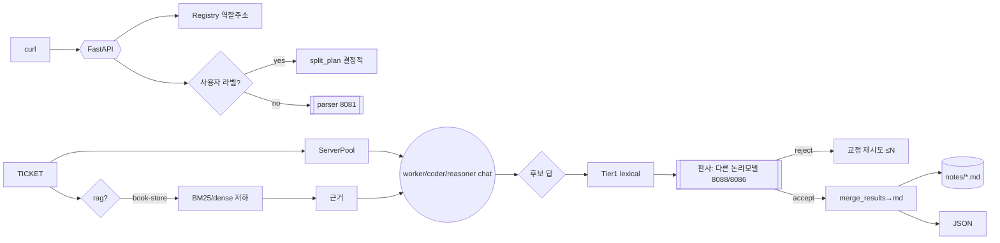

# POST /run-plans — 내부 동작 (현행)

`agent/` 패키지. 하나의 계획서 요청이 실제 로컬 LLM 들을 거쳐 결과 파일/JSON 까지
가는 흐름과, "틀 이탈" 을 막는 검증(판사) 단계를 간결히 정리.

```bash
curl -X POST localhost:8080/run-plans -H 'Content-Type: application/json' \
  -d '{"plan":"[Task 1: explain] …", "rag":"book-store"}'
```

전체: **① HTTP → ② 구성/매핑 → ③ 티켓 분해 → ④ RAG 근거 → ⑤ 병렬 worker →
⑥ Tier1 검증 → ⑦ LLM 판사(Tier2) → ⑧ 재시도/갱신 → ⑨ markdown 저장 → ⑩ JSON**

---

## ① HTTP 진입 — `agent/api.py`
- Uvicorn(`AGENT_MODE=live`)이 `POST /run-plans` 수신 → `RunPlanRequest`로 body 검증
  (`plan≥1글자`, 아니면 **422**).
- **live**(실서버) / mock(오프라인 echo)은 `AGENT_MODE`로 결정.
- 블로킹 작업은 루프를 막지 않게 `loop.run_in_executor`(스레드 풀)로 위임 — 이후 단계는 그
  워커 스레드에서 실행.

## ② 구성 — role→주소 (`agent/registry.py`)
- `Registry`가 역할→서버 주소 매핑. `network_mode: host`라 컨테이너 `127.0.0.1:808x`가
  곧 호스트(서버)에 떠 있는 myllm llama-server.

| role | 주소 | 모델 |
|---|---|---|
| parser | 8081 | Qwen2.5-7B (티켓) |
| worker | 8082–8085 (×4 라운드) | Phi-3.5-mini |
| coder | 8086–8087 | qwen2.5-coder-7b |
| reasoner | 8088 | DeepSeek-R1-Distill (판사 기본) |
| embed | 11434(Ollama)/or llama `--embeddings` | 벡터 |

- 주소는 `agent/config/agent.yaml` or env `AGENT_*`로 재정의 가능. 이 단계는 주소만 준비(네트워크 없음).

## ③ 티켓 분해 — `planner.py`
- 사용자가 `[Task …]`/`## Task` 라벨을 달았으면 **결정적 `split_plan`(라벨 존중, 모델 안 씀)** →
  `[Task: explain]`=worker 등 고정(parser가 explain→reasoner로 새는 것 방지).
- 라벨 없는 자유 텍스트만 `parser`(8081)로 정규화(또는 실패 시 로컬).

## ④ RAG 근거 — `rag.py` (요청에 `rag:"book-store"`일 때)
- `describe_store`/`StudyStoreRetriever`가 env `STEMER_STORE`(기본 mount `/app/store`)의
  책 청크(`미적분` 34청크 등)를 로드.
- 밀집(코사인) 시도 → 임베더가 `--embeddings` 없어 501이면 **BM25 어휘로 자동 저하** (하드실패 방지).
- 이 청크들이 "근거(REFERENCE CONTEXT)"로 뒤에 주입됨. `sources`가 이걸 반영.

## ⑤ 병렬 worker — `orchestrator._run_one`
- `ServerPool`이 역할별 서버 하나(라운드) 선택 → OpenAI 호환 `/v1/chat/completions`호출.
- 여러 Task는 `ThreadPoolExecutor`로 **병렬**. 프롬프트는 `prompts.py`(정확한 질문 재인용 +
  "원문 정리/공식 있으면 그대로" 규칙)가 만듦.

## ⑥ Tier-1 검증 — `grounding.py` (무료, 네트워크 없음)
- 빈 답/너무 짧음 / **완전 오토픽 drift**(아무 source와 어휘/LaTeX도 안 섞임)만 조기 배제.
- 도메인 마커 하드코딩 없음(일반 규칙).

## ⑦ LLM 판사 Tier-2 — `verify.py`
- **다른(논리적) 모델**로 답 검증(자기확증 방지):
  - worker/coder가 만든 답 → **reasoner(8088, DeepSeek-R1)**,
  - reasoner가 만든 답 → **coder(8086)**. (`AGENT_JUDGE`로 재정의)
- 판사가 참조(source) 대비 답의 참/거짓·오류·예외를 JSON으로 평결:
  `{ok, grounded, errors[], exceptions[], reason}`.
- 판사 서버 장애/응답불가 → 하드실패 대신 "verdict deferred"(명시 통과).

## ⑧ 재시도 / 틀 이탈 표시
- Tier1 또는 판사가 거절 → `correction_prompt`(“원문 그대로 재현”) 로 **최대
  `grounding_retries`(기본 2)회 재생성·재검증**.
- 소진 후에도 틀 이탈 → `grounded:false` + `grounding_note:"rejected xN: <사유>"`로
  markdown/JSON에 **명시**(조용한 오답 방지).

## ⑨ 취합·저장 — `prompts.merge_results` / `orchestrator` writer
- 각 WorkerResult를 `## Task {id} · {role}` 블록으로 묶어 markdown 하나로.
  `UNGROUNDED`면 그 Task에 붉은 경고 붙임.
- `<note_dir>`의 `agent-<UTC시각>.md`로 저장(도커에선 호스트 `./agent-notes/` bind로 영속).

## ⑩ JSON 응답 — `api._to_response`
```json
{ "stem": "...", "note_path": "/app/notes/…", "total":1, "ok_count":1,
  "mode":"live",
  "tasks":[{ "task":1,"role":"worker","url":"…8082…","ok":true,"output":"…",
             "sources":["미적분","공학수학"], "grounded":true,
             "grounding_note":"" }],
  "markdown":"…" }
```
- `grounded`/`grounding_note` 로 틀 이탈 여부를 클라이언트가 즉시 판별.

---

## 흐름 요약



원칙 요약: **근거만 사용**, **라벨 존중**, **판사=다른 모델로 자기확증 방지**,
**틀 이탈은 자동 재시도 후에도 안 되면 명시 표시**.
