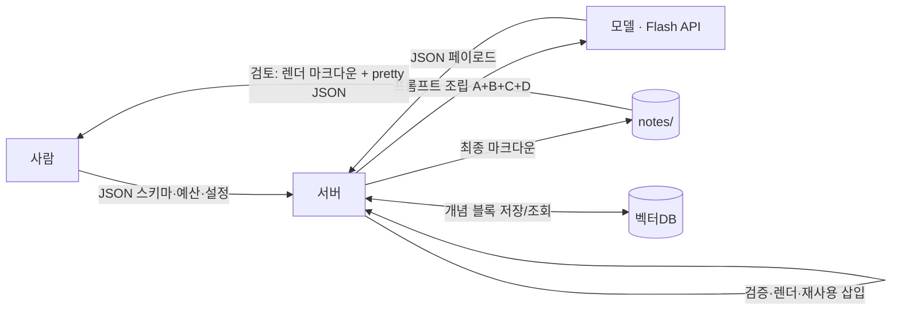

# 생성 출력 프로토콜 v1 — 100% JSON

> `NEW-STRATEGY.md`(API + RAG 전환)의 **생성 계층** 상세 규약.
> **출력 토큰 = 유일한 가변 비용**($0.66/M, 피크 시간대 ×2)이므로, 이 프로토콜의
> 유일한 목적은 **모델이 "새로 쓰는 텍스트 절대량"을 최소화하고 예산 안으로 통제**하는 것이다.
>
> **v0 폐기**: "사람은 YAML, 기계는 JSON"을 시도했으나, YAML 미리보기에서 KaTeX/백슬래시
> 내용이 깨지고 그 위에서 린팅도 어려워 폐기 → **전 계층 JSON으로 단일화**.

---

## 1. 핵심 원칙

1. **100% JSON.** 모델 페이로드·사람용 미리보기·스키마·예산·설정이 전부 JSON.
   - 이유(실측): YAML은 들여쓰기·콜론·파이프·`!`·`#` 때문에 수학/KaTeX(백슬래시) 내용에서
     파싱이 깨지고, 그 위에서 KaTeX 린트도 돌리기 어려움.
   - JSON은 `response_format=json_object`로 구조를 강제할 수 있고, 검증·렌더·린트가 단일 파이프라인.
2. **모델 출력 = 진짜 새로운 의미 내용만.** 구조·포맷·반복·출처·메타데이터는 서버 소유(토큰 0).
3. **재사용 우선.** 검증된 개념 블록은 모델에게 묻지 않고 서버가 삽입(토큰 0).
4. **예산은 상한, 실패는 슬롯 단위.** 필드 상한 초과/빈 슬롯 발생 시 해당 슬롯만 재요청 — 전체 재생성 금지.
5. **그림은 생성하지 않는다.** 모든 그림은 **교재 원본에서만** 가져오고 서버가 부착(토큰 0).
   생성형 그림(코드·스펙·설명)은 품질 부실 + 비용 낭비라 **금지** — 모델 페이로드에 그림 슬롯이 없다.

## 2. 계층도



## 3. 사람 계층 — 검토 & 설정 (JSON)

- **스키마·예산·설정** — §4를 **JSON 파일**로 버전 관리. 코어 + 과목별로 분리
  (`gen-protocol/v1/{core,math,phys,chem,bio}.json`).
- **검토** — 기본 검토 대상은 서버가 렌더한 **최종 마크다운**(KaTeX가 실제 렌더된 상태로 확인).
  슬롯 단위 수정이 필요하면 **pretty-printed JSON**을 보고, 서버가 해당 슬롯만 patch 재요청.
- **YAML 미사용** — 미리보기·설정 어디에도 YAML을 쓰지 않는다.
- **적용 범위** — JSON 강제는 구조화 데이터(페이로드·스키마·예산·미리보기)에 적용.
  프롬프트 상수(고정 가이드 A+B, 템플릿)는 자유 형식 파일로 유지한다.

## 4. 기계 계층 — JSON (모델 ↔ 서버)

- **형식**: 단일 JSON 객체. `response_format={type:"json_object"}`로 구조 강제.
  설명문·마크다운·코드펜스 일절 금지.
- **키**: **코어(1글자, 전 과목 공통) + 주제 팩(과목별 확장)** 구조.
  스키마는 과목별로 고정·등록(`v1/{math,phys,chem,bio}.json`)되고, 키 사전은 해당 과목의
  캐시된 시스템 프롬프트에 정의 → 추가 비용 없음.
- **플렉서블의 정의**: 키를 모델이 창조하면 검증이 깨진다 → 키는 **주제별로 선별된 등록 사전에서만**.
  미등록 키는 reject → patch.
- **컴팩트 출력**: pretty-print 금지(줄바꿈·들여쓰기 최소화).
- **주의 — LaTeX 이스케이프**: JSON 문자열 안의 백슬래시는 `\\`로 이스케이프 필수.
  이스케이프 실패는 파싱 실패 → 슬롯 재시도로 처리. **가능하면 `\epsilon` 류 대신
  유니코드 심볼(ε, ∀, ∃, →, ≤, ≠)을 쓰는 규칙**으로 리스크·토큰을 동시에 줄인다.

### 키 사전 — 코어 (스키마 v1, 전 과목 공통)

| 키 | 의미 | 키 | 의미 |
|---|---|---|---|
| `cs` | 개념 슬롯 배열 | `ex` | 대표유형(worked example) 배열 |
| `c` | 개념명 | `p` | 문제 서술 |
| `d` | 정의 | `s` | 해설 |
| `f` | 공식/법칙 (+성립 조건) | `pr` | 연습문제 배열 (해설 없음) |
| `k` | 핵심 직관 | `r` | 의사결정 순서 레시피 |
| `m` | 자주 하는 오개념 | `as` | 응용(실생활/공학 매핑) 배열 |

### 키 사전 — 주제 팩 (과목별 확장)

규칙:
- **빈도 기준**: 노트마다 반복되는 키만 코어(1글자). 과목 고유 개념(반응식·경로·증명)은
  드물게 등장하므로 2~4글자여도 토큰 부담이 없다.
- **검증**: 서버가 과목 스키마(`v1/phys.json` 등)로 허용 키를 강제. 미등록 키 = reject.
- 사전은 해당 과목 고정 가이드(B)에 포함되어 캐시 히트.

**수학** (`v1/math.json`)

| 키 | 의미 |
|---|---|
| `th` | 정리 (이름 + 서술) |
| `prf` | 증명 (요약) |
| `cd` | 성립 조건 / 엣지케이스 |
| `cx` | 반례 |

**물리** (`v1/phys.json`)

| 키 | 의미 |
|---|---|
| `law` | 법칙 (이름 + 수식) |
| `var` | 물리량 표 (기호·의미·단위) |
| `case` | 극한/근사 성립 조건 |
| `setup` | 실험/상황 장치 |
| `sign` | 부호 규약 |

**화학** (`v1/chem.json`)

| 키 | 의미 |
|---|---|
| `eq` | 균형 반응식 |
| `cond` | 반응 조건 |
| `mech` | 메커니즘 단계 |
| `spec` | 화학종 (구조) |
| `trend` | 주기/경향 규칙 |
| `ox` | 산화수/전자 이동 |

**생물** (`v1/bio.json`)

| 키 | 의미 |
|---|---|
| `path` | 경로/과정 단계 |
| `cmp` | 비교 (구조·기능 표) |
| `cyc` | 대사 순환 |
| `tree` | 계통/분류 관계 |
| `org` | 구조·기관 (라벨/기능) |
| `exp` | 실험 설계 |

> 주제 팩 키의 **구체적 형태**(스칼라/배열/행 구조)는 각 과목 스키마 JSON이 정의한다.
> 예: 화학 `eq` = 반응식 문자열 배열, 생물 `cmp` = `[항목, 대상A, 대상B]` 행 배열.

### exam 가이드 v1 와이어 스키마 — 코어 (전 과목)

```json
{
  "cs": [ {"c": "", "d": "", "f": "", "k": "", "m": ""} ],
  "r":  "",
  "as": [ "" ],
  "ex": [ {"p": "", "s": ""} ],
  "pr": [ "" ]
}
```

### exam 가이드 v1 와이어 스키마 — 주제 팩 확장 예 (화학)

주제 팩 키는 페이로드 **최상위의 선택 슬롯**으로 추가된다. (개념 단위로 붙는 변형은
해당 과목 스키마 JSON이 정의)

```json
{
  "cs":   [ {"c": "", "d": "", "f": "", "k": "", "m": ""} ],
  "eq":   [ "2 H2 + O2 → 2 H2O" ],
  "cond": "촉매, 25°C, 1 atm",
  "mech": [ "...", "..." ],
  "trend": "",
  "r":    "",
  "ex":   [ {"p": "", "s": ""} ],
  "pr":   [ "" ]
}
```

### note / problems kind (v1.1)

`note`와 `problems`는 exam의 변형(슬롯이 더 적음). kind는 과목 스키마와 함께
레지스트리에서 결정되고, kind별 스키마 JSON이 형태·예산을 정의한다.

**note** — 개념 노트 1편 (문제 없음). 코어 키만 사용.

```json
{
  "cs": [ {"c": "", "d": "", "f": "", "k": "", "m": ""} ],
  "r":  "",
  "as": [ "" ]
}
```

**problems** — 문제 + 해설 세트. `pr`이 **객체 배열**로 바뀐다
(exam의 `pr`은 풀이 없는 문자열 배열 — 형태는 kind 스키마가 정의).

```json
{
  "pr": [ {"lvl": "b", "p": "", "s": ""} ]
}
```

- `lvl`: 난이도 — `"b"`(basic) | `"a"`(advanced). problems kind 전용 키.
- `p`/`s`: 문제 / 해설 (코어 키 재사용).
- 문제당 예산(안): basic p≤50·s≤100 / advanced p≤70·s≤140. 개수는 요구에 따라
  (예: basic ≤6, advanced ≤3) — 실제 검토 후 튜닝.
- **풀이가 출력 비용의 대부분**이므로, 풀이가 필요 없는 연습은 exam `pr`(풀이 없음)을 쓰고
  풀이가 꼭 필요한 것만 problems kind로 생성한다.

### 필드 예산 v1 (토큰, 상한 — 실제 출력 검토 후 조정)

| 슬롯 | 개수 | 필드당 상한 | 슬롯 합계 |
|---|---|---|---|
| `cs` | ≤ 3 | c≤12 · d≤90 · f≤70 · k≤45 · m≤45 | ≤ 780 |
| `r` | 1 | ≤ 140 | ≤ 140 |
| `as` | ≤ 3 | ≤ 50 | ≤ 150 |
| `ex` | ≤ 3 | p≤100 · s≤160 | ≤ 780 |
| `pr` | ≤ 4 | ≤ 70 | ≤ 280 |

- **typical 목표 ≈ 1,500 / ceiling ≈ 2,100** 토큰/가이드 (기존 4,000 대비 ~45~65% 절감).
- 서버 `MAX_TOKENS` = ceiling + JSON 오버헤드 여유(≈ 2,300). **"넉넉히" 금지** — 잘려서 버려지는 토큰은 순손실.
- 주제 팩 키는 노트당 드물게 등장하므로 예산 영향이 미미 — 개별 상한은 과목 스키마 JSON에서 정의.

### 예시 — JSON 와이어 (컴팩트)

```json
{"cs":[{"c":"Limit of a sequence","d":"A sequence (a_n) converges to L if for every epsilon>0 there is an N after which all terms stay within epsilon of L.","f":"lim a_n = L ⇔ ∀ε>0 ∃N: n>N ⇒ |a_n−L|<ε","k":"Only the tail matters — the first N terms are irrelevant.","m":"Treating divergence to infinity as convergence."}],"r":"1) Guess L 2) Form |a_n−L| 3) Bound below ε 4) Solve for N.","as":["Stability of iterative solvers: error → 0 as n → ∞"],"ex":[{"p":"Prove a_n = n/(n+1) converges to 1.","s":"|a_n−1| = 1/(n+1) < ε ⇔ n > 1/ε − 1, choose N = ⌈1/ε⌉."}],"pr":["a_n = (2n+3)/(3n−1), find the limit","a_n = (−1)^n / n, find the limit"]}
```

### 예시 — 사람용 미리보기 (pretty JSON, 검토/수정용)

```json
{
  "cs": [
    {
      "c": "Limit of a sequence",
      "d": "A sequence (a_n) converges to L if for every ε>0 there is an N ...",
      "f": "lim a_n = L ⇔ ∀ε>0 ∃N: n>N ⇒ |a_n−L|<ε",
      "k": "Only the tail matters — the first N terms are irrelevant.",
      "m": "Treating \"grows without bound\" as convergence."
    }
  ],
  "r": "1) Guess L  2) Form |a_n−L|  3) Bound below ε  4) Solve for N.",
  "as": ["Stability of iterative solvers: error → 0 as n → ∞"],
  "ex": [
    {
      "p": "Prove a_n = n/(n+1) converges to 1.",
      "s": "|a_n−1| = 1/(n+1) < ε ⇔ n > 1/ε − 1, choose N = ⌈1/ε⌉."
    }
  ],
  "pr": ["a_n = (2n+3)/(3n−1), find the limit", "a_n = (−1)^n / n, find the limit"]
}
```

## 5. 렌더링 & 재사용 (서버)

- **렌더**: JSON → 템플릿(마크다운+KaTeX) → 최종 노트. 헤더·번호·레이아웃·프런트매터는
  서버가 템플릿+메타(제목·kind·출처 섹션)로 생성 — 모델 출력 아님.
- **개념 블록 라이브러리**: (개념명 `c` + 내용)을 벡터DB에 검증 블록으로 저장.
  새 요청에서 히트 시:
  - 해당 `cs` 슬롯을 **모델 요청에서 제외**(프롬프트에 "슬롯 N개는 이미 확보" 통지),
  - 렌더 단계에서 서버가 블록을 삽입 → 그 내용의 출력 토큰 = **0**.
- **출처·섹션번호·문제번호**: 모델이 절대 생성 금지, 서버 메타데이터에서 주입(환각 방지 + 토큰 절약).

### 그림 정책 — 교재 원본만 (v1.1, 생성 금지)

- **금지**: 코드·스펙·설명 기반의 그림 생성. (부실한 결과 + 출력/재시도 비용)
- **허용**: 교재에서 추출·인덱싱된 그림(그림 코퍼스)만 사용.
- **부착**: 모델이 선택하지 않는다. 서버가 토픽의 섹션/검색 청크와 매칭되는 교재 그림을
  렌더 시 삽입 — 캡션·페이지 출처는 서버 메타데이터에서 주입(모델 출력 아님).
- **없으면 없음**: 해당 섹션에 교재 그림이 없으면 노트에 그림을 넣지 않는다(만들어 채우지 않음).
- 렌더된 그림은 캐시되어 여러 노트에서 재사용(렌더 비용 0).

## 6. 파이프라인 순서

1. 토픽 pop → 레지스트리에서 title/kind/섹션 매핑 확인.
2. 개념 라이브러리 검색 → 커버되는 슬롯 결정(재사용 마킹).
3. 벡터DB 검색(C) — 상위 3~5 + 섹션 매핑 + 리랭크.
4. 프롬프트 조립: `[A 고정 시스템] + [B 고정 가이드(과목별 키사전·예산)] + [재사용 통지] + [C 검색 조각] + [D 질문]`
   — **가변부(C+D)는 항상 맨 뒤** → 프리픽스 캐시 히트 극대화.
5. API 호출 — 오프피크 배치, `response_format=json_object`.
6. **로컬 검증**(무료): JSON 파싱 → 스키마 → 필드별 토큰 예산 → 빈 슬롯 체크.
7. 통과 → 렌더 + 라이브러리 저장 / 실패 → **해당 슬롯만 patch 재요청**(≤2회) → 실패 시 사람 검토 대기.
8. KaTeX 린트(로컬) → 최종 마크다운 저장 → `draft`.

## 7. 검증 & 실패 격리

- 검증은 전부 로컬(비용 0). 재생성은 **슬롯 단위**로 격리 → 실패 비용 최소화.
- **patch 요청**: 원본 JSON + "빈/초과 슬롯만 채워라". 고정부는 그대로(캐시 히트).
- retry 상한 2회 초과 시 해당 토픽을 `review` 대기로 — **무한 루프 금지**.

## 8. 비용 기대 (실단가 · 오프피크)

| 구분 | 출력 토큰/가이드 | 출력 비용/가이드 |
|---|---|---|
| 기존(자유 생성) | 4,000 | ≈ $0.0026 |
| 프로토콜 typical | 1,500 | ≈ $0.0010 (~60% 절감) |
| ceiling (상한) | 2,100 | ≈ $0.0014 |

- 입력(캐시 히트 위주)은 전체의 소수 — 출력이 지배적.
- 피크 시간대는 출력도 ×2 → **배치는 반드시 오프피크**에.

## 9. 오픈 이슈

- **예산 튜닝**: §4 수치(exam·note·problems)는 v1 제안. 실제 출력 10건 검토 후 필드별 상한 조정 필요.
- **유니코드 vs KaTeX**: 페이로드에서 유니코드 심볼을 쓰면 이스케이프 리스크·토큰을 줄이지만,
  최종 렌더에서 KaTeX 변환 규칙을 별도로 정의해야 함.
- **컴팩트 JSON 지시가 품질에 미치는 영향** 측정 필요.
