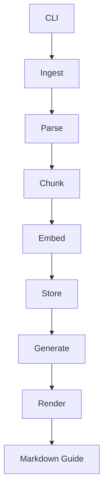

# Project Analysis – **study** (교재 RAG 공장)

---

## Table of Contents
1. [Project Overview](#project-overview)
2. [Architecture & Directory Tree](#architecture--directory-tree)
3. [High‑Level Documentation Summary](#highlevel-documentation-summary)
4. [Core Python Package (`study_lib`)](#core-python-package-study_lib)
   - [Public API (`__init__`)](#public-api-__init__)
   - [Ingestion Pipeline (`ingest.py`)](#ingestion-pipeline-ingestpy)
   - [Parsing (`parse.py`)](#parsing-parsepy)
   - [LLM Integration (`llm.py`)](#llm-integration-llmpy)
   - [Rendering (`render.py`)](#rendering-renderpy)
   - [Command‑Line Interface (`cli.py`)](#command-line-interface-clipy)
5. [GEN‑PROTOCOL Schema (`schema.json`)](#genprotocol-schema-schemajson)
6. [Testing Contracts](#testing-contracts)
7. [Future Work & Open Questions](#future-work--open-questions)

---

## Project Overview
- **Name:** `study` – a library for building a *RAG* (Retrieval‑Augmented Generation) pipeline for textbooks.
- **Goal:** Turn raw PDFs / Markdown / TXT files into chunked, embedded, searchable data and generate structured study guides using a JSON‑only LLM API (DeepSeek Flash).
- **Key Principles**
  1. **Contract‑first TDD** – all public behaviour is locked down by tests under `tests/` (e.g., `test_ingest_contract.py`).
  2. **Modular design** – each stage (ingest, parse, chunk, embed, store, generate, render) lives in its own module under `study_lib/`.
  3. **Pluggable components** – embedder can be `stub` or a transformer model; parser can be `text`, `fast` (pypdf) or `docling` (OCR).
  4. **Zero‑cost generation** – LLM calls are limited to the JSON payload defined in `GEN‑PROTOCOL`.

---

## Architecture & Directory Tree
```
study/
├─ README.md
├─ DEPLOY.md
├─ EXECUTION-PLAN.md
├─ config/
│   └─ gen_protocol/v1/schema.json
├─ data/
├─ docker/
│   ├─ Dockerfile
│   └─ build.sh
├─ guides/
│   ├─ bio.md
│   ├─ chem.md
│   ├─ math.md
│   └─ phys.md
├─ pilot/
│   ├─ registry.json
│   ├─ run-pilot.sh
│   └─ sample-calculus.md
├─ study_lib/
│   ├─ __init__.py
│   ├─ ingest.py
│   ├─ parse.py
│   ├─ llm.py
│   ├─ render.py
│   ├─ cli.py
│   ├─ chunk.py
│   ├─ embed.py
│   ├─ factory.py
│   ├─ figures.py
│   ├─ registry.py
│   ├─ retrieve.py
│   ├─ store.py
│   └─ ... (other helpers)
└─ tests/
    ├─ test_ingest_contract.py
    ├─ test_parse_contract.py
    └─ (many other contract tests)
```

---

## High‑Level Documentation Summary
### README.md
- Describes the **TDD‑first** approach, the list of slices (registry, protocol, chunk, …) and the CLI usage examples.
- Highlights the **deployment** entry‑point (`python -m study_lib.cli …`).

### DEPLOY.md
- Lists required environment variables (`STUDY_REGISTRY`, `STUDY_STORE`, `DEEPSEEK_API_KEY`).
- Provides step‑by‑step commands for setting up a virtual‑env, installing `requirements.txt` and `requirements-embed.txt`, and running a smoke test.

### EXECUTION‑PLAN.md
- Outlines four phases: engine migration, bulk indexing, cost‑effective generation, and continuous quality tuning.
- Supplies concrete cost estimates (≈ $0.001 per generated topic) and hardware budgeting (8‑core CPU, 64 GB RAM, no GPU).
- Emphasises **parallel ingestion** and **pipeline pipelining** (index while generating other books).

---

## Core Python Package (`study_lib`)

### Public API (`__init__`)
```python
from . import chunk, discover, embed, factory, figures, ingest, lint, llm, parse, profiles, protocol, registry, render, retrieve, store, subjects, tokens

__all__ = [
    "chunk", "discover", "embed", "factory", "figures", "ingest", "lint",
    "llm", "parse", "profiles", "protocol", "registry", "render",
    "retrieve", "store", "subjects", "tokens",
    "Chunk", "ChunkProfile", "chunk_markdown",
    "DiscoverReport", "discover_topics", "topic_title",
    "StubEmbedder", "TransformerEmbedder", "embed_text",
    "GenerateResult", "generate_one", "build_system", "build_user",
    "Figure", "FigureRegistry", "attach_figures", "register_parsed_figures",
    "BatchReport", "IngestReport", "ingest_dir", "ingest_one",
    "LintIssue", "lint_katex",
    "LLMClient", "LLMError", "LLMResult", "Usage", "FlashClient",
    "extract_usage", "parse_json_content",
    "ParsedBook", "get_parser", "parse_source",
    "load_profile", "profile_names",
    "Book", "Library", "Topic",
    "render_guide",
    "Reranker", "CrossEncoderReranker", "RetrievedChunk", "RetrievedContext",
    "rerank_top", "retrieve",
    "IndexStore", "IndexedChunk", "JsonDurableSink",
    "PgDurableSink", "pg_create_sql", "pg_delete_book_sql", "pg_read_sql",
    "pg_upsert_sql",
]
```
The package re‑exports most internal modules, making them directly importable via `study_lib.<module>`.

---

### Ingestion Pipeline (`ingest.py`)
- **Entry point:** `ingest_dir(directory, library, store, ...)`
- **Workflow per book**
  1. **Register / skip** – checks `Library.book_status`. If already `INDEXED` and `force=False`, the book is skipped.
  2. **Parallel workers** – when `jobs>1`, a multiprocessing pool is created (`ctx = multiprocessing.get_context(os.getenv('STUDY_MP_START', 'spawn'))`). Each worker runs `_worker_ingest` which:
     - Calls `parse_source` (respecting per‑book parser profile).
     - Chunking via `chunk_markdown`.
     - Embedding with either `StubEmbedder` or `TransformerEmbedder` (batch size 32).
     - Writes chunks to `IndexStore` (JSONL by default).
  3. **Finalisation** – `_finalize` updates the `Library` status to `INDEXED` and records any error.
- **Retry / failure handling** – failed books get status `FAILED` and an error string stored in the registry; subsequent runs will retry them.
- **Key constants** – `EMBED_BATCH = 32`, `_EXTS = {'.pdf', '.md', '.txt'}`.
- **Dataclasses** – `IngestReport` and `BatchReport` summarise outcomes.

---

### Parsing (`parse.py`)
- **Profiles** – `text` (plain TXT), `fast` (pypdf, fast but no OCR), `docling` (full OCR/VLM). The function `resolve_profile` infers a profile from file extension when not explicitly supplied.
- **Core classes** – `ParsedBook` (holds `book_id`, `title`, `markdown`, `parser`, optional `pages` and `figures`).
- **Heading reconstruction** – `_reconstruct_heads` turns lines like `1.1 Intro` into Markdown headings (`## 1.1 Intro`) while skipping TOC pages.
- **Scanned‑PDF detection** – `detect_scanned` checks character count per page against `MIN_CHARS_PER_PAGE = 150`.
- **Public function** – `parse_source(path, profile=None, book_id="", page_range=None, log=None)` returns a `ParsedBook`.

---

### LLM Integration (`llm.py`)
- **Client interface** – `LLMClient` protocol with `complete(system, user, max_tokens=1000, json_object=True)`.
- **FlashClient** – concrete implementation using `httpx` to call DeepSeek’s `/chat/completions` endpoint (OpenAI‑compatible). Handles optional `thinking` and `reasoning_effort`.
- **Cost model** – `Usage` dataclass records `prompt_tokens`, `completion_tokens`, `cache_hit_tokens`, `cache_miss_tokens`. `cost_usd(peak=False)` computes cost using rates (`RATE_CACHE_HIT = 0.007`, `RATE_CACHE_MISS = 0.22`, `RATE_OUTPUT = 0.66`).
- **JSON extraction** – `parse_json_content` strips optional ```json fences and loads the model output.
- **Error handling** – `LLMError` raised for network failures, non‑200 responses, or malformed JSON.

---

### Rendering (`render.py`)
- **Purpose:** Convert a validated GEN‑PROTOCOL payload (a dict) into the final Markdown guide.
- **Template logic** – `render_guide(payload, title, subject, kind, section=None, book_id=None, source=None)` builds a markdown document:
  1. YAML front‑matter (`---` block) with meta fields.
  2. Title heading.
  3. Core sections (`lecture`, `cs`, `r`, `as`, `ex`, `pr`) rendered by `_render_core`.
  4. Extension sections (subject‑specific packs) rendered by `_render_extension` using `EXT_LABELS`.
- **Core order** – defined per `kind` (`exam`, `note`, `problems`).
- **Concept block** – `_concept_block` formats definition, formula, intuition, and common mistake.
- **Solved‑problem block** – `_render_solved_problems` formats problem/solution pairs with optional level labels.

---

### Command‑Line Interface (`cli.py`)
- **Workspace dataclass** – bundles paths for `registry`, `store`, `notes` and provides helpers `library()` and `open_store()`.
- **Sub‑commands** – `books`, `topics`, `index`, `ingest`, `generate`, `status`, `postkatex`, `problembank`, `chapter`, `accumulate`, etc.
- **Mapping to library functions** – each sub‑command calls the corresponding function in `study_lib` (e.g., `ingest_dir`, `parse_source`, `generate_one`).
- **Embedding selection** – `_resolve_embedder` picks `StubEmbedder` or falls back to `TransformerEmbedder`.
- **Error handling** – catches `KeyError`, `ValueError`, `LLMError`, `OSError` and prints a user‑friendly message.

---

## GEN‑PROTOCOL Schema (`schema.json`)
- **Version:** `v1`
- **Core keys** – `lecture`, `cs`, `c`, `d`, `f`, `k`, `m`, `r`, `as`, `ex`, `p`, `s`, `pr`.
- **Subject‑specific packs** – e.g., for `math` we have `th`, `prf`, `cd`, `cx`.
- **Kinds & budgets** – defines allowed fields for `exam`, `note`, `problems` together with token‑budget constraints (e.g., `lecture` budget 1500 tokens, `cs` fields budgets 12‑90 tokens, etc.).
- The schema is used by the **factory** and **render** modules to validate payloads before generation.

---

## Testing Contracts
- The `tests/` directory contains *contract* tests that lock down the public behaviour of each slice.
- **`test_ingest_contract.py`** verifies:
  - New books are indexed, skipped, or forced‑re‑indexed correctly.
  - Failure handling (empty markdown → `FAILED` status) and subsequent retry.
  - Parallel execution (`jobs=2`) yields the same result as sequential.
  - Per‑book parser precedence over CLI default.
  - Per‑book page‑range propagation to `parse_source`.
- Similar contract tests exist for `parse`, `llm`, `render`, `factory`, `store`, etc., ensuring the pipeline is **TDD‑first**.

---

## Future Work & Open Questions
| Area | Observation | Suggested Action |
|------|-------------|------------------|
| **Type Hints** | Some modules (e.g., `ingest.py`) lack full type annotations for public functions. | Add `typing` hints and run `mypy` in CI. |
| **Embedding Backend** | `TransformerEmbedder` pulls in heavy dependencies (`torch`, `sentence‑transformers`). | Consider optional lazy import or a lightweight on‑disk encoder for CI. |
| **Schema Validation** | Payload validation is implicit; no explicit JSON‑Schema check. | Integrate `jsonschema` validation before rendering. |
| **Parallelism** | Uses `multiprocessing` with `spawn`; on some platforms this may be slower than `fork`. | Benchmark both start‑methods and expose a CLI flag. |
| **Error Reporting** | `LLMError` messages include raw response snippets; could be noisy. | Truncate to 200 characters and add a `--debug` flag for full payloads. |
| **Documentation** | README is concise but could benefit from a visual pipeline diagram. | Add a Mermaid flowchart (see below) to the README. |

---

### Mermaid Flow Diagram (for README)


---

*Generated on 2026‑09‑08 by the automated analysis assistant.*

---

