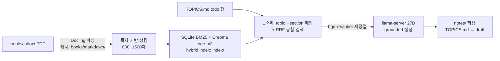

# study/ — 교재 RAG 파이프라인

교재 PDF를 넣어 두면 밤새 **파싱 → 청킹 → 하이브리드 인덱싱 → 노트 생성**까지
자동으로 끝내주는 파이프라인입니다. 생성 엔진은 기존 llama-server
(Qwen3.6-27B, `../up.sh`)을 그대로 사용합니다.



## 1. 설치 (서버에서 1회)

```bash
bash study/setup.sh
```

- Docker가 없으면 설치합니다 (sudo 필요, `docker` 그룹 재로그인 안내).
- 이미지 빌드 후 watcher 컨테이너를 백그라운드로 띄웁니다.
- 임베딩(`bge-m3`)·리랭커(`bge-reranker-v2-m3`) 모델을 미리 다운로드합니다 (수 GB).

## 2. 매일 밤 사용법

1. 교재 PDF를 `study/books/inbox/`에 넣습니다 (SCP/SFTP 등).
2. `TOPICS.md`에 만들 주제를 `todo` 상태로 적습니다 — 또는 DB로 관리합니다 (아래 §9).
3. 그냥 잡니다.

watcher가 5분마다 inbox를 확인하고, 순서대로 처리합니다:

| 단계 | 처리 |
|---|---|
| 인덱싱 | PDF 파싱(캐시됨) → 청킹 → BM25 + 벡터 인덱스 → `books/processed/`로 이동 |
| 노트 생성 | `todo` 행마다 검색 → 리랭킹 → llama-server 호출 → `notes/`에 저장 → 상태 `draft` |

- **중단돼도 안전**: 파싱 결과는 `books/markdown/`에 캐시되고, 완료된 주제는
  `draft`로 바뀌므로 재시작하면 이어서 처리합니다.
- **진행 상황**: `study/logs/pipeline.log`를 보세요.
  ```bash
  docker compose -f study/docker/docker-compose.yml logs -f pipeline
  tail -f study/logs/pipeline.log
  ```

## 3. 노트 하나만 즉시 생성

```bash
cd study
docker compose -f docker/docker-compose.yml run --rm pipeline \
  python tools/gen_note.py "Normal distribution" --book prob --section 3.5 --update-topics
```

- `--section 3.5, 3.6`처럼 여러 섹션 가능 (1순위 후보로 항상 포함).
- `--effort high`: 엄밀함이 필요한 주제는 thinking 강도를 올립니다.
- `--crossref 5`: 교차참조 청크 수 조절 (기본 3).
- `TOPICS.md`에 있는 주제면 `--book/--section` 생략 가능합니다.

## 4. 동작 모드 (수동 실행용)

```bash
cd study
docker compose -f docker/docker-compose.yml run --rm pipeline python tools/pipeline.py --once
docker compose -f docker/docker-compose.yml run --rm pipeline python tools/pipeline.py --once --index-only
docker compose -f docker/docker-compose.yml run --rm pipeline python tools/pipeline.py --once --generate-only --book prob
docker compose -f docker/docker-compose.yml run --rm pipeline python tools/pipeline.py --prefetch
```

## 5. 설정 (`study/docker/.env`)

| 변수 | 기본값 | 설명 |
|---|---|---|
| `LLAMA_BASE_URL` | `http://127.0.0.1:8000/v1` | llama-server 주소 (host 네트워크라 그대로 동작) |
| `LLAMA_API_KEY` | (빈 값) | 서버 `config.env`에 API_KEY 설정 시 필수 |
| `REASONING_EFFORT` | `low` | 근거가 컨텍스트에 있으므로 낮춰도 품질 유지. `medium`/`high`로 조정 가능 |
| `MAX_TOKENS` | `4096` | 노트 1편당 토큰 상한 (thinking 포함). 잘리면 올리세요 |
| `WATCH_INTERVAL_S` | `300` | inbox 확인 주기(초) |
| `OMP_NUM_THREADS` | `14` | 파싱/임베딩용 스레드 (llama-server에 여유를 남김) |

고급: `EMBED_MODEL`, `RERANK_MODEL`, `CHUNK_MAX_CHARS`, `N_CROSSREF` 등은
`tools/rag/config.py`에서 환경변수로 재정의할 수 있습니다.

## 6. 예상 시간 (실측 권장)

| 작업 | 예상 |
|---|---|
| Docling 파싱 | 텍스트 레이어 있는 PDF 기준 페이지당 1~3초 → 800쪽 ≈ 20~40분 |
| 임베딩 | bge-m3 CPU로 1만 청크 ≈ 5~15분 |
| 노트 생성 | 27B Q8_0 약 2 tok/s, effort `low` 기준 편당 약 20~50분 |

8시간 밤이면 **인덱싱 + 노트 10편 내외**가 현실적입니다. 노트가 많으면
다음 날 `--generate-only`로 이어서 돌리면 됩니다 (완료분은 자동 건너뜀).

## 7. 품질 원칙

- `study/AGENTS.md` 규칙이 시스템 프롬프트로 주입됩니다 (영어만, 1페이지,
  교재 우선, KaTeX 규칙, draft→review→done).
- 생성 직후 금지 KaTeX 환경(`align`, `equation`, `\bm` 등)을 자동 린트하고
  경고를 남깁니다. `study/tools/check_katex.py`가 있다면 최종 검증에 사용하세요.
- RAG는 오류를 줄이지 제거하지는 않습니다. **`done`은 교재 대조 후에만** 찍으세요.

## 8. 문제 해결

- **`docker: permission denied`** → 로그아웃/로그인 또는 `newgrp docker`.
- **노트가 안 만들어짐** → `../up.sh`로 llama-server가 떠 있는지 확인
  (`curl http://127.0.0.1:8000/health`). 인덱싱은 서버 없이도 진행됩니다.
- **PDF가 inbox에 남아 있음** → `logs/pipeline.log`에서 해당 파일 오류 확인.
  스캔본(이미지 PDF)이면 OCR 품질이 낮을 수 있습니다.
- **재색인** → 해당 PDF를 inbox에 다시 넣고
  `python tools/pipeline.py --once --force --index-only` 실행.
- **인덱스 초기화** → `rm -rf study/index` 후 `--index-only` 재실행
  (markdown 캐시가 있어 재파싱 없이 빠릅니다).
- **전체 초기화** → `manage.py reset-all --yes`: registry·인덱스·업로드 PDF·
  노트·로그를 모두 삭제해 최초 설치 상태로 되돌립니다. `AGENTS.md`와
  템플릿, HF 모델 캐시는 유지됩니다. 실행 전 워커 중지 권장:
  `docker compose -f study/docker/docker-compose.yml stop pipeline api`
- **청킹 규칙 적용** → `python tools/test_chunk.py` + `python tools/test_rag.py`로
  검증 후 `python tools/manage.py reindex-all`로 전체 재인덱싱 (책당 임베딩 약 1시간).

## 9. TOPICS.md / AGENTS.md를 DB로 관리하기

`TOPICS.md`(구조 데이터)와 `AGENTS.md`·`templates/warmup.md`(프롬프트 문서)는
SQLite 레지스트리 **`study/registry.db`가 원본**이고, 마크다운 파일은 자동으로
내보내는 스냅샷(git에 커밋됨)입니다.

```bash
cd study
python tools/manage.py --help
python tools/manage.py status    # registry + 인덱스 + 진행 상태 한눈에
python tools/manage.py reindex <book_id>   # 청킹 로직 변경 후 한 권만 재인덱싱
python tools/manage.py reindex-all         # 전부 재인덱싱 (책당 약 1시간, 재파싱 없음)
python tools/manage.py reset-all --yes     # DB·인덱스·업로드 PDF·노트·로그 전체 초기화
python tools/test_chunk.py                  # 청킹 휴리스틱 테스트 36개
python tools/test_rag.py                    # 핵심 로직 테스트 42개 (store/registry/generate/retrieve/api)

# 초기화 (첫 실행 시 기존 TOPICS.md/AGENTS.md를 자동으로 DB에 올림)
python tools/manage.py init

# 교재 등록
python tools/manage.py books add prob --title "Introduction to Probability" --author "Blitzstein"

# 주제 등록 (자동으로 todo 상태 + TOPICS.md 재생성)
python tools/manage.py topics add "Normal distribution" --book prob --section 3.5

# 조회 / 상태 변경
python tools/manage.py topics list --status todo
python tools/manage.py topics set "Normal distribution" --status done

# 규칙 문서도 DB에서 관리
python tools/manage.py docs set agents --file AGENTS.md   # 파일 -> DB
python tools/manage.py docs get agents                    # DB -> 출력
```

- DB가 비어 있으면 파이프라인·CLI 첫 실행 시 마크다운 파일을 자동으로
  가져옵니다 (마이그레이션 불필요).
- 마크다운을 손으로 고쳤다면 `python tools/manage.py import`로 DB에 반영하세요.
- 상태 변경(생성 완료 포함) 시 `TOPICS.md`가 자동 재생성되어 git diff로
  진행 상황을 볼 수 있습니다.
- `registry.db`는 gitignore 대상 — 삭제해도 `import`로 복원됩니다.

## 10. 웹 UI (nginx)

`http://<서버_IP>:8080` — 스타일 없는 순수 HTML UI입니다. nginx(공식 이미지)가
정적 UI를 서빙하고 `/api/`를 파이프라인 API(FastAPI, `tools/api.py`)로 프록시합니다.

| 구역 | 기능 |
|---|---|
| 1. PDF 업로드 | 교재 PDF를 `books/inbox/`로 전송 → watcher가 자동 인덱싱 |
| 2. 에이전트 지시사항 | `AGENTS.md` 내용을 브라우저에서 편집·저장 (registry DB 반영) |
| 3. 토픽 설정 | topic/book/section/note 추가 (todo), 상태 전환 버튼 |
| 4. 상태 | llama-server 상태, 토픽 현황, 최근 로그 (15초 자동 갱신) |
| 5. 결과물 다운로드 | **생성된 노트 전체를 ZIP으로 다운로드** + 개별 파일 링크 |

- ZIP에는 `notes/*.md`가 담깁니다. 마크다운 뷰어(KaTeX 지원)에서 열어 읽으세요.
- UI/API에 인증이 없으므로 LAN 내부에서만 쓰는 것을 전제로 합니다
  (llama-server와 동일한 신뢰 모델).
- 기동/종료: `../worker-up.sh` / `../worker-down.sh` (이미지 없으면 자동 빌드,
  `--build`로 강제 재빌드). 코드 수정은 볼륨 마운트라 재빌드 불필요 —
  `requirements.txt`/`Dockerfile` 변경 시에만 `--build` 필요.
- 방화벽: LAN에서 UI 접속하려면 8080 개방 필요
  (`sudo ufw allow 8080/tcp` 또는 `study/docker/.env`에서 `UI_FIREWALL_ENABLE=on` →
  worker 스크립트가 자동 개방/폐쇄). SSH 터널만 쓴다면 불필요:
  `ssh -N -L 8080:127.0.0.1:8080 <사용자>@<서버_IP>`
- nginx 포트 변경은 `study/web/nginx.conf`의 `listen 8080`과 .env의 `UI_PORT`를 함께 수정하세요.
