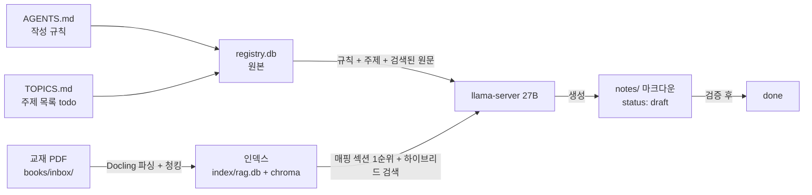

# 예제: 미분방정식 스터디 세팅 가이드

> "미분방정식을 공부하고 싶다"를 가정한 완전한 예제입니다.
> 두 입력 파일의 역할 — **AGENTS.md = 어떻게 쓸 것인가(규칙), TOPICS.md = 무엇을 만들 것인가(목록)** —
> 이 예제를 그대로 복사해 쓰셔도 됩니다.

## 1. 전체 구조 (파이프라인 흐름)



| 요소 | 위치 | 내용 | 바꿀 시점 |
|---|---|---|---|
| 교재 PDF | `books/inbox/` | 원서 | 새 책 추가 시 |
| **AGENTS.md** | registry `docs` (웹 UI 구역 2에서도 편집) | **작성 규칙** (언어·형식·KaTeX·증명 금지…) | 규칙을 바꾸고 싶을 때 |
| **TOPICS.md** | registry `topics` (웹 UI 구역 3에서도 추가) | **만들 노트 목록** (topic/book/section/status) | 주제 추가 시 |
| 결과물 | `notes/*.md` | 생성된 노트 (draft) | 매일 확인 |

**핵심**: AGENTS는 한 번 잘 써두면 모든 책에 공통으로 적용됩니다. TOPIC은 주제마다 한 줄씩 추가합니다.

---

## 2. AGENTS.md에 쓸 내용 (미분방정식 예제)

아래 내용을 웹 UI **구역 2**의 텍스트박스에 붙여넣거나,
`AGENTS.md` 파일에 저장 후 `manage.py docs set agents --file AGENTS.md`로 반영합니다.

```markdown
# Study note conventions (canonical)

Purpose: warm-up notes read BEFORE the original textbook. The textbook is the source of truth.

## Language & scope
- English only (US English).
- One topic per note, about one page (~400-900 words). No deep proofs.

## Textbook-first rule
- Every definition, theorem and notation must match the textbook exactly.
- Always link to the textbook chapter/section (e.g. "see §1.3").
- Section numbers must be accurate. Take them from the provided textbook
  excerpts only — never guess.

## Differential equations conventions (이 부분이 예제 핵심)
- State the ODE form first, then the solution method. Example:
  "A first-order linear ODE has the form $y' + P(x)y = Q(x)$."
- Keep the textbook's notation for derivatives: use $y'$, $\mathrm{d}y/\mathrm{d}x$
  or $y^{(n)}$ exactly as the book does. Never mix notations.
- For each method, give ONE worked example matching the textbook's steps,
  then link the remaining examples to the textbook ("see Examples 2-4 in §1.5").
- Mention existence/uniqueness assumptions only if the excerpt contains them.

## Math rendering (KaTeX only)
- Allowed environments: aligned, cases, matrix, pmatrix, bmatrix, vmatrix,
  array, alignedat, smallmatrix.
- Forbidden: align, equation, eqnarray, gather, split, proof, theorem.
- Use \operatorname and \boldsymbol (NOT \bm), \mathrm{d} for differentials;
  never \mathds.
- Display math only inside $$ ... $$. Inline math inside $ ... $.

## Status lifecycle
draft -> review -> done. "done" requires human verification against the textbook.

## Format
Follow templates/warmup.md.
```

**설명**:
- 앞부분(언어·1페이지·증명 금지)은 공통 규칙입니다.
- `Differential equations conventions`처럼 **책/과목별 규칙을 한 블록씩 추가**하면 됩니다.
- 이 내용이 그대로 시스템 프롬프트로 주입되어 노트가 이 규칙을 따릅니다.

---

## 3. TOPICS.md에 쓸 내용 (미분방정식 커리큘럼 예제)

주제 목록 예시 (웹 UI 구역 3에서 한 줄씩 추가, 또는 `topics add`):

| topic | book | section | kind | status | note |
|---|---|---|---|---|---|
| Separable equations | 공학수학 | 1.3 | note | todo | |
| First-order linear differential equations | 공학수학 | 1.5 | note | todo | |
| Exact equations and integrating factors | 공학수학 | 1.4 | note | todo | |
| Homogeneous linear ODEs with constant coefficients | 공학수학 | 2.2 | note | todo | |
| Nonhomogeneous linear ODEs | 공학수학 | 2.5 | note | todo | |
| Laplace transform | 공학수학 | 6.1 | note | todo | |
| Separable equations practice | 공학수학 | 1.3 | problems | todo | |
| First-order linear ODEs practice | 공학수학 | 1.5 | problems | todo | |
| Laplace transform practice | 공학수학 | 6.1 | problems | todo | |

- **topic**: 노트 제목 (영어). 섹션 제목을 그대로 쓰면 검색이 가장 정확합니다.
- **book**: PDF 파일명에서 파생된 book_id. `공학수학.pdf`를 업로드했다면 `공학수학`.
  (`manage.py status`에서 실제 id 확인 가능)
- **section**: 주제가 있는 교재 섹션 번호. 검색 **1순위 후보**로 원문 전체가 주입됩니다.
- **kind**: `note` = 개념 노트 1편 / `problems` = **기초 10 + 중급 이상 10 문제**와
  **별도 솔루션 파일** 2개 생성.
- **note**: 파일 경로 (비우면 주제 이름으로 자동 지정).

**섹션 번호를 모를 때** (인덱싱 후 서버에서):

```bash
grep -nE '^#{1,3} ' ~/projects/stemer/study/books/markdown/공학수학.md | head -60
```

---

## 4. 실제 등록 명령 (서버)

```bash
cd ~/projects/stemer/study
DC="docker compose -f docker/docker-compose.yml exec pipeline python tools/manage.py"

# ① 교재 등록 (선택 — UI 드롭다운용)
$DC books add 공학수학 --title "공학수학" --author "저자명"

# ② 규칙 등록 (AGENTS.md 파일을 DB로)
$DC docs set agents --file AGENTS.md

# ③ 주제 등록 (todo 상태로 자동 생성됨)
$DC topics add "Separable equations" --book 공학수학 --section 1.3
$DC topics add "First-order linear differential equations" --book 공학수학 --section 1.5

# ④ 문제 세트 등록 — 기초 10 + 중급 10 문제, 솔루션 별도 파일
$DC topics add "Separable equations practice" --book 공학수학 --section 1.3 --kind problems

# ⑤ 확인
$DC status
```

웹 UI(`http://<서버_IP>:8080`)로 하면 ②는 구역 2, ③은 구역 3에서 클릭만으로 됩니다.

---

## 5. 생성 결과물 예시 (notes/separable-equations.md)

파이프라인이 실제로 만들어 줄 노트의 모양입니다:

```markdown
---
topic: Separable equations
book: 공학수학
sections: 1.3
status: draft
generated: 2026-08-28
---

# Separable equations

## Motivation

Many first-order ODEs can be solved by separating the variables ...

## Key definitions

- A first-order ODE is **separable** if it can be written as
  $$ g(y)\, \mathrm{d}y = f(x)\, \mathrm{d}x $$  (see §1.3)

## Main idea

Move every $y$ term to one side and every $x$ term to the other, then integrate both sides.

## Formulas

$$
\int g(y)\, \mathrm{d}y = \int f(x)\, \mathrm{d}x + C
$$

## Link to textbook

- See 공학수학 §1.3, Examples 1-3.

## Checkpoints

1. Is $y' = xy$ separable? Solve it.
```

---

## 6. 상태 흐름과 검증

```
todo ──(밤새 자동 생성)──▶ draft ──(사람이 교재 대조)──▶ review ──▶ done
```

- `todo`인 행만 생성됩니다. 생성되면 자동으로 `draft`가 됩니다.
- `done`은 **반드시 교재와 대조한 후에만** 찍으세요 (RAG는 오류를 줄이지 제거하지 않습니다).
- UI 구역 4에서 상태 전환 버튼, 구역 5에서 ZIP 다운로드.

---

## 7. 자주 하는 실수

| 실수 | 결과 | 해결 |
|---|---|---|
| book 값을 PDF 파일명과 다르게 씀 | 검색이 0건 → 노트 안 생김 | `manage.py status`의 book_id 확인 |
| 섹션 번호를 추측으로 씀 | 엉뚱한 섹션 주입 | markdown 캐시에서 목차 grep으로 확인 |
| topic을 한국어로 씀 | 규칙(영어)과 충돌, 검색 저하 | topic만 영어로 |
| AGENTS를 비워둠 | 기본 규칙으로만 생성 | §2 예제를 복사해 넣기 |
